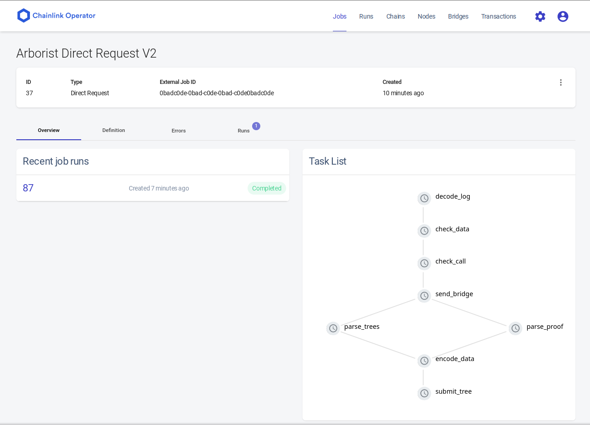
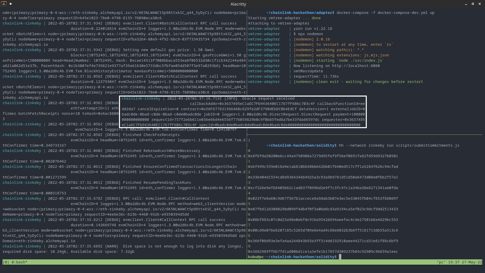
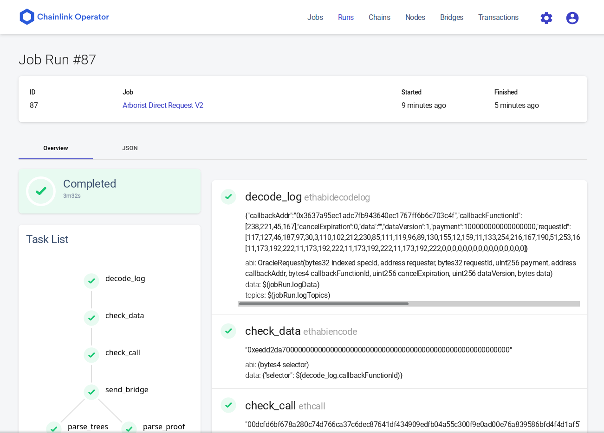
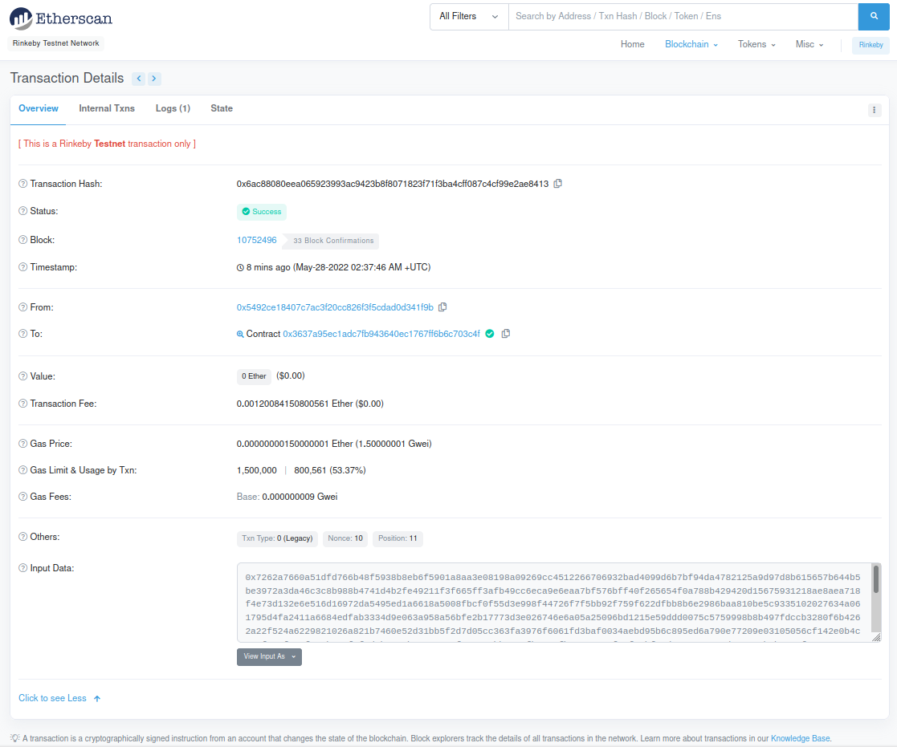

# Chainlink Verifiable Merkle Trees

[VMTree Demo Page](https://vmtree.vercel.app/)

## Summary

This hackathon project is an improvement project. We set out to connect [Verifiable Merkle Trees](https://github.com/twister-vmt) to the Chainlink network. From the previous README:

>Verifiable Merkle Tree
>
>The Verifiable Merkle Tree (VMT) is a new kind of SNARK data structure that is powered by Computational Integrity Proofs (CIPS). The VMT is useful for maintaining an up-to-date merkle tree of commitments on an EVM based blockchain, e.g. Ethereum, which is so popular that demand for blockspace causes gas prices to be high at times. VMT helps reduce costs to individual users, lowering the cost barrier for use-cases like on-chain privacy.
>
>Computational Integrity Proofs
>
>CIPs are zero knowledge proofs without any secret parameters--all inputs are public. We're not seeking privacy with this structure, just verifiability. SNARKs enable succinct verification of computations, in this case, we compute the next state of a merkle tree given a list of leaves, then we submit that for verification in an EVM based smart contract where the resulting state is stored.
>
>Tradeoffs
>
>One of the tradeoffs of this design is that we require off-chain computations to construct the SNARK proof, meaning a third party periodically pays gas to advance the tree...

This project addresses the issues with the tradeoffs by integrating with Chainlink. The project has four major components:

1. [Node configuration](https://github.com/vmtree/hackathon/commit/2add10064a7166d79e92a6b3e1c9369824ae29c2)
2. [External adapter](https://github.com/vmtree/adapter/tree/75fee505734b90496b7559768cb4efeddb25c2a7)
3. [Solidity contracts](https://github.com/vmtree/solidity/tree/92606598b3e9835fd583155c9e79bf3d31096e6c)
4. [Web admin panel](https://github.com/vmtree/app/tree/1f80b792525ec803d85cd4676f32cead38a56f19)

Each of these components are included as submodules in this repository. They each contain their own README files with pertinent information specific to that component.

## Description 

VMTree is a 10x gas optimization effort. We use out-of-the-box thinking to save on costs; instead of gas golfing for marginal savings, we apply a completely different conceptual framework for using the blockchain. That is, rather than using blockchain computations to directly update the state of a SNARK-friendly merkle tree, we use blockchain computations to verify a proof that a new state is valid according to the mathematics underpinning zero knowledge proofs, and if the proof is valid, then we simply accept the new state as true.

With Chainlink + VMTree, users will reliably experience minimal transaction fees to deposit into privacy mechanisms that use SNARK friendly merkle trees. This is a core tool that will be useful for a multitude of zero knowledge proof applications.

This project is the beginning of a new Chainlink Decentralized Oracle Network. The VMTree Chainlink integration is foundational to the fully realized version of the [Twister Cash](https://twistercash.xyz/) token anonymity protocol, which is a multi-chain stablecoin mixer that will have its foundation in Arbitrum much as many other multi-chain blockchain projects have their foundation in Ethereum. We are guaranteed a first customer for this new Chainlink DON wherever the Twister Cash protocol is deployed.

## Proof of State Change on Rinkeby Testnet
We need to enhance the security of the chainlink node. Currently, the node has only run in a local terminal, but it should be running 24/7 in a cloud provider or on a dedicated machine in the future. We include a series of screenshots showing the job specification on the Chainlink node operator ui, the terminal screen during a live update, and a rinkeby etherscan transaction that the Chainlink node submitted to update a tree.

[Click here to view transaction on rinkeby etherscan.](https://rinkeby.etherscan.io/tx/0x6ac88080eea065923993ac9423b8f8071823f71f3ba4cff087c4cf99e2ae8413)